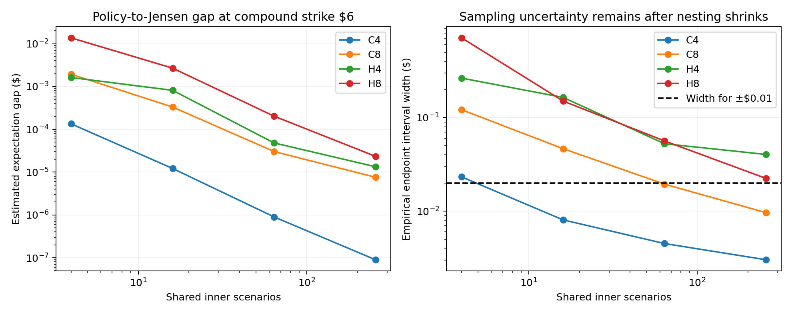

# Compound Asian-basket experiment: findings and decision

Executed 22 September 2026 under the [frozen protocol](PROTOCOL.md).
Source, commands and artifact map: [research README](../../research/compound_feasibility/README.md).
Existing manuscript and previous research evidence are unchanged.

## Verdict

**No defensible significant quantum advantage established yet.** The compound
option has genuine nonlinear nesting, but this GBM development family does not
provide the expensive classical problem needed to offset the quantum work.
Strong classical controls and an accurate exercise policy make the remaining
nesting error small. Explicit quantum-inner estimation remains extremely costly.

**Stop scaling the tested GBM compound-pricing construction toward an advantage
claim.** Do not open the held-out confirmation study. This completes the
feasibility experiment with a negative decision; it does not fulfill the
significant-advantage objective or prove that all quantum compound-pricing
algorithms lose.

The most consequential new finding is classical, not a circuit tweak: future
GBM return paths can be reused across exercise-date states, and conditional
geometric controls make a simple exercise policy nearly sufficient for these
contracts. The quantum-inside-quantum theorem remains valid under its access
assumptions; our experiment does not refute it. It fails to turn into a useful
pricing crossover with the constructed estimator and arithmetic.

## Workload and accuracy contract

We price one call on an arithmetic Asian-basket call, with one exercise decision
at tau=T/2:

    H = exp(-r*(T-tau)) * (A_T - 100)+,
    C_tau = E[H | F_tau],
    P = exp(-r*tau) * E[(C_tau - Kc)+].

A_T includes every contractual fixing, including those accrued before tau.
The state contains the asset prices at tau and the accrued contribution to the
average. All assets start at100, r=.03, with equal weights and equicorrelated
GBM drivers. Monitoring is contractual. Exact GBM transitions at these dates
avoid an SDE-discretization bias or artificial fine-step burden.

| Case | Assets | Dates | Volatility | Correlation | Years | Compound strikes |
|---|---:|---:|---:|---:|---:|---|
| C4 | 4 | 12 | .20 | .20 | 1 | 3,6,9 |
| C8 | 8 | 12 | .40 | .20 | 1 | 3,6,9 |
| H4 | 4 | 12 | .40 | .70 | 3 | 3,6,9 |
| H8 | 8 | 24 | .40 | .20 | 3 | 3,6,9 |

These twelve contracts were fixed before acquisition. They are development
cases, not twelve independent confirmations of advantage. They do not exhaust
heterogeneous baskets, sixteen assets, fifty-two dates, stochastic volatility,
or multiple exercise dates. Those would require their own financial and cost
justification, rather than being added after an unfavorable outcome.

The acceptance criterion remains $.10/$.03/$.01 absolute error,99% per-price
confidence, and10x full latency improvement over the strongest eligible
classical method on20/24 held-out cases, at least3x on all cases. A ten-million
physical-qubit/60-second planning screen is retained. None of those quantum
confirmation criteria was achieved.

## Why the classical problem becomes inexpensive

Conditional on exercise-date spots, GBM future values are current spot times
future return factors. The arithmetic future contribution is therefore a dot
product of the spot vector and a vector of precomputed future return sums.
It is unnecessary to simulate an entirely new future time path separately for
every outer state. We generate correlated factors using scrambled Sobol,
Brownian bridge and asset PCA, then reuse them. Randomization replicates remain
independent; dependence within a crossed outer/inner quadrature is retained in
its uncertainty calculation.

For each outer state, the geometric average of future fixings is lognormal.
Its conditional capped call expectation is analytic. Subtracting this payoff
and adding its known conditional expectation gives an unbiased conditional
estimator of the arithmetic payoff. We also test a moment-matched lognormal
continuation approximation and an independently trained regression correction.
Policy selection uses separate validation data, never the pricing replicates.

Training uses4,096 outer states and128 inner scenarios; validation uses1,024
states and512 inner scenarios. Even when the simpler moment policy wins, its
training/selection expenditure is charged. Policy correctness is **not** assumed
in the reference price: an inaccurate policy merely widens the bound below.

For any independently frozen binary policy d(X) and conditionally unbiased
controlled mean Z_M(X), the exact expectation inequalities are

    exp(-r*tau) E[d(X)*(Z_M(X)-Kc)]
       <= P_capped
       <= exp(-r*tau) E[(Z_M(X)-Kc)+].

The lower inequality follows by conditioning on X; the upper follows from
convexity. We estimate both ends on fresh randomizations. A narrow expectation
gap is informative even if the regression has no uniform approximation proof.
Sampling uncertainty must still be added; the observed gap alone is not an
error bar or a certified upper bound on its population value.

An actual antithetic nested MLRQMC estimator was also executed. Its base uses256
inner scenarios; levels512/1,024 subtract the average of the two half-sample
positive-part estimates. Each level has independent outer/inner randomizations.
The frozen outer allocation is8,192/1,024/512 points with32 replicates. This
telescopes to the finite1,024-inner-sample Jensen upper target, while an
independent-policy lower estimator bounds the true conditional-expectation
price. It is not plain nested Monte Carlo presented as a strong baseline.

Dense nested kernel quadrature, sparse grids and GPU code were not required to
reject the present quantum construction. They remain possible stronger classical
competitors. [Chen et al., ICML2025](https://proceedings.mlr.press/v267/chen25av.html)
was checked as relevant prior art; its author code was not executed in this
experiment. No claim of globally optimal classical pricing is made.

## Tail error and reference prices

The inner payoff is capped at B, with a deterministic allowance connecting it
to the original uncapped contract. Convexity and the outer payoff's Lipschitz
property give

    0 <= P - P_capped
       <= exp(-r*T) average_j E[(S(t_j)-100-B*exp(r*(T-tau)))+].

The right side is computed from vanilla lognormal call moments, not estimated
from sample maxima. Selected caps and dollar tail bounds:

| Case | Inner payoff cap B | Uncapped-price tail allowance |
|---|---:|---:|
| C4 | 128 | .00002644 |
| C8 | 512 | .00000876 |
| H4 | 2,048 | .00005029 |
| H8 | 2,048 | .00003981 |

The independent reference starts with32 replicates,32,768 outer points and2,048
inner scenarios. H4/H8 receive a second independent32-replicate acquisition
with4,096 inner scenarios. The final reference uses both acquisitions with
equal weight; a mixture of valid Jensen upper estimators remains an upper
estimator, despite their different inner sample counts. Welch endpoint
intervals account empirically for their different variances. No outcomes are
selected by price value. The stopped matrix implementation repeats seeds from
the streaming implementation and contributes **no extra statistical evidence**.

Representative reference results, compound strike6:

| Case | Reference midpoint | Empirical99% interval half-width, including cap allowance |
|---|---:|---:|
| C4 | 1.246291 | .000128 |
| C8 | 3.197430 | .000423 |
| H4 | 13.100618 | .000766 |
| H8 | 7.684419 | .000837 |

All twelve final reference interval widths are below$.002; the largest is
$.001996 for H8,strike3. The full table is in
[reference_table.json](../../results/compound_feasibility/decision_v1/reference_table.json).
These are **empirical randomized-QMC intervals**, not rigorous floating-point
enclosures or a proof of99% coverage. Exact-date GBM removes the earlier SDE
bias issue; floating arithmetic and PRNG idealization remain separate.

At compound strike6, the final estimated lower-to-upper expectation gaps are
about4e-8,2e-6,4.7e-6 and6.2e-6 dollars for C4/C8/H4/H8. Most reported
uncertainty is sampling error, not unresolved exercise policy or inner-average
bias. The hard part presumed by a naive nested-MC comparison is largely absent
in this development region.

## Measured classical cost, with confidence levels distinguished

The matrix implementation's nested MLRQMC run took8.32/11.87/7.91/16.09 seconds
for C4/C8/H4/H8 respectively, including policy training. Every one of its twelve
empirical intervals had width below$.02, sufficient for a midpoint with
empirical +/-$.01 error. These are warm workstation measurements; some
development jobs overlapped, so they are not controlled timing distributions.

The streaming implementation avoids N-by-M temporary arrays and is tested
against the matrix estimator on identical paths. Fresh-process timing was then
run separately after the other jobs finished, with a new native compilation
cache, fresh pricing seeds, and policy retraining:

| Case | Full cold-process time | Largest empirical interval half-width across strikes |
|---|---:|---:|
| C4 | 12.44 seconds | .000570 |
| H8 | 13.85 seconds | .007014 |

These times include imports, compilation, training/validation, acquisition and
output. All three strikes share work; we conservatively charge the **entire
three-strike elapsed time to each individual price**. There is no uncharged
portfolio amortization. The experiment uses the available CPU, not a GPU.
Exact environment versions are recorded in the validation receipt.

### A separate nonasymptotic sampling check

To avoid relying only on empirical scramble intervals, we executed a fixed-N
iid acquisition for C4:4,194,304 independent outer states, each with16
independent conditional paths. The future scenarios are **not** shared across
outer observations in this run. The independent policy is frozen beforehand.

The two-sided empirical-Bernstein inequality from
[Maurer--Pontil, Theorem4](https://arxiv.org/abs/0907.3740), with .005 failure
per endpoint and a union bound, provides99% per-price statistical coverage
under exact iid sampling/evaluation. The range2B*exp(-r*tau) bounds both
controlled endpoints; no estimated support bound is used.

| Compound strike | Lower confidence endpoint | Upper endpoint including cap tail | Midpoint radius |
|---|---:|---:|---:|
| 3 | 2.238710 | 2.254730 | .008010 |
| 6 | 1.238962 | 1.251413 | .006225 |
| 9 | .632997 | .642369 | .004686 |

This acquisition took267.84 seconds including the charged policy training.
The statistical bound is rigorous under its stated ideal sampling/arithmetic
premises. It is **not** a fully certified machine-arithmetic financial result;
floating error and pseudorandom implementation are not proved away. All three
intervals contain their independently obtained RQMC reference intervals. The
result supplies a much stronger confidence comparison than treating a
scramble standard error as a theorem.

## Quantum implementation and schedule

We use the quantum-inner approximation hierarchy motivated by
[Blanchet et al., Algorithms2--4 and AppendicesA.1--A.3](https://arxiv.org/abs/2502.05094).
This mechanism estimates a sequence of increasingly accurate quantum inner
values and applies mean estimation to their coupled differences. It is not
naive double amplitude estimation, and the compound-call application itself
already appears in the paper. No novelty is claimed for that combination.

The numerical schedule here uses explicit bounded QAE inside and the existing
explicit signed dyadic mean estimator outside. The paper's stronger
Kothari--O'Donnell implementation is not compiled; a separate favorable
unit-constant sensitivity is provided rather than assigning its unknown
constants a proven value.

For numerical scale a, set R=B/a, normalized accuracy eta=.8*epsilon/a,
L=ceil(log2(2/eta)). At inner level l, set accuracy2^(-l-1) and failure
2^(-2l-3)/R^2. Choose a power-of-two M satisfying

    R*pi/M + R*pi^2/M^2 <= 2^(-l-1).

The odd median repetition count is chosen from the exact binomial failure tail
using the standard8/pi^2 QAE success guarantee. Each run pays2M-1 source or
inverse calls, M-1 Grover iterates and its QFT rotations. Inner medians must be
coherent; measuring them classically cannot supply the required outer oracle.

Clipping into[0,R] gives a mean-square inner error at most(3/8)*4^(-l).
Consequently the coupled outer difference has a valid second-moment bound no
larger than10*4^(-l), also bounded by R^2. The base is improved using an analytic
unconditional moment bound, rather than charging R^2 blindly:

    E[(C-Kc)+^2] <= E[(H-Kc)+^2]
      <= discounted average of squared vanilla-call moments.

Minkowski's inequality combines this bound with the base inner error. The
moment bound uses Kc=3 and is valid for every tested strike. It is verified
against independent one-dimensional numerical integration. Uniform conditional
raw second moments still use the cap: a small pooled sample variance is not a
substitute for a bound valid for every outer state.

Outer statistical failure totals .004. Inner bias plus outer statistical error
is budgeted within .8*epsilon. The remaining error allowance must cover tails,
input discretization, arithmetic and synthesis; it is **not closed** here.
Scales1,16 and B were screened, and the cheaper actual schedule retained. This
prevents dollar normalization alone from manufacturing an unfavorable count.
Exact toy spectral distributions validate inner moments and the telescoping
base term independently of the finance simulator.

### Real compiled components

Clean GBM log-step and capped-payoff X/CX/CCX circuits were actually emitted,
including inverse cleanup. Existing gate-emitted exponential, multiply and
Gaussian-loader blocks were reused with their recorded counts. At32 fractional
bits, C4's clean GBM step uses134,456 T gates and dependency T-depth37,472;
its capped payoff uses81,634 T gates and depth44,328. GBM is substantially
cheaper per step than the previous stochastic-volatility implementation.

The price oracle is a **charged macro composition**, not an emitted monolithic
coherent nested circuit. Every fixing is weighted before accumulation to avoid
an unnecessarily large unscaled basket sum. The cost screen contains actual
conditional-source and inverse counts, both inner hierarchy levels, outer
state generation, and a declared retained-copy memory policy.

The arithmetic subtotal excludes QPE-value decoding, coherent median sorting,
some reflection/bin assembly, QFT and Gaussian rotation synthesis, routing,
measurement, decoding and quantum preprocessing. Counts or obligations are
exposed separately. They are favorable omissions in a failed screen, not free
resources in a claimed positive crossover. The conditional geometric control
is available conceptually to both sides but its quantum circuit is not built;
the current uniform residual bound would still be the cap. A better proved
conditional bound could change the schedule and is an untested algorithmic
improvement, not silently ruled out.

## Crossover result

For epsilon=$.01,32 fractional bits, the improved analytic-moment screen gives:

| Case | Explicit conditional source/inverse calls | Arithmetic T subtotal | Favorable unit-constant source calls, without logarithms/confidence overhead |
|---|---:|---:|---:|
| C4 | 1.110e15 | 2.413e23 | 2.844e7 |
| C8 | 7.474e15 | 3.250e24 | 1.437e8 |
| H4 | 4.861e16 | 1.057e25 | 8.092e8 |
| H8 | 4.861e16 | 4.220e25 | 7.989e8 |

The last column is an optimistic calculation using the hierarchy's moment
bounds and ideal mean-estimation scaling with coefficient one. It is neither
a compiled algorithm nor a lower bound on all quantum algorithms. The explicit
construction is conservative; failing its cost screen is not a disproof of the
optimal source-access theorem. All24 tolerance/precision combinations and
normalization schedules are archived in the authoritative `cost_v3` artifacts.

In consistent units, with Q conditional source uses and mean source latency c:

    T_quantum >= Q*c + other charged work,
    c <= (T_classical/10 - setup - other work)/Q

is the required crossover condition **for that schedule**. Even granting zero
quantum setup and ignoring the outer work, the measured cold classical times
allow only:

| Case | Quantum10x total budget | Per-source budget using favorable unit-constant calls |
|---|---:|---:|
| C4 | 1.244 seconds | 43.75 nanoseconds |
| H8 | 1.385 seconds | 1.733 nanoseconds |

Those are whole conditional-pricing-source budgets, not per-gate clocks. For
comparison, just one current32-fractional-bit multiplication has76,032 T layers.
At a hypothetical100 ns per logical T layer it takes7.6032 milliseconds. Making
all other work free and charging only **one such multiplication per favorable
source use** gives216,247 seconds for C4 and6,074,074 seconds for H8. This is a
sensitivity coordinate for the present arithmetic, not a universal lower bound.

The separate C4 formal-statistics classical run also matters: its267.84-second
cost permits26.78 seconds for a10x win. The same favorable one-multiply screen
still needs roughly8,100-fold further reduction. This conclusion is therefore
not based solely on comparing empirical classical intervals with a rigorous
quantum statistical theorem. A complete machine-arithmetic contract remains
open on both sides.

The physical sensitivity reuses the declared surface-code/factory model from
the earlier experiment, based on
[Litinski, Figure19 and Equations10--11](https://arxiv.org/abs/1808.02892).
The retained independent coherent-copy policy consumes
about1.17--3.78 million logical wires at$.01. It fails the ten-million physical
qubit screen even before a complete layout. Two-level distillation at physical
error.001 also fails the huge arithmetic-injection budget. These are failures
of the declared implementation and memory policy, not necessary qubit counts
for every implementation. No vendor roadmap changes the result without a
mapped gate, factory, routing and failure calculation.

## Numerical and scientific limits

Paired512-path diagnostics compare independent integer GBM arithmetic with
floating evaluation. Across the four models, f=24 mean inner-payoff differences
range from about-$.000071 to-$.000498; the largest sampled absolute difference
is$.00192. At f=32, mean differences are below$.000002 in magnitude and sampled
absolute differences below$.000007. These are diagnostics, not uniform bounds.

Finite Gaussian q=10 does not certify the needed input accuracy: paired mean
differences have standard errors up to$.00712. q=14 improves the diagnostic but
is also not a certificate. The resource screen retains the cheaper compiled
q=10 loader as a favorable incomplete scenario. Gaussian truncation tails,
quantization, exponential approximation, clipping, overflow and nested
decoder precision must be connected rigorously before any positive claim.

| Claim | Evidence status |
|---|---|
| Genuine compound-option nesting | Established by the financial contract; not an artificial tower rewrite |
| Exact expectation lower/upper bounds and analytic cap allowance | Derived and implemented; independent tests |
| Cheap pricing on the twelve GBM development contracts | Executed classical evidence; empirical intervals unless explicitly marked EB |
|99% nonasymptotic sampling coverage for the C4 iid run | Valid under ideal iid/exact-evaluation premises; floating implementation not certified |
| Generic nonlinear quantum query improvement | Literature level3; not a structured-finance lower bound against best classical methods |
| Explicit hierarchy schedule and emitted arithmetic counts | Executed/tested implementation evidence; full nested finance circuit remains incomplete |
| Conditional end-to-end fault-tolerant advantage | Not established |
| Hardware advantage | Not attempted or established |
| Impossibility of any quantum compound-pricing advantage | Not established |

## What to do with this result

Do not replace the manuscript's claims with an advantage claim. The useful
deliverable is a reproducible benchmark and a falsified implementation-level
feasibility hypothesis. Whether a separate methods/benchmark paper is novel
enough requires its own editorial and prior-art assessment; negative results
alone do not guarantee publication.

Reopening this direction needs **both** a financially justified workload whose
conditional value cannot be approximated and bracketed cheaply by the strongest
classical methods, and a substantially cheaper explicit coherent estimator.
Relevant possibilities include proved controls localizing the nonlinear
correction near the exercise boundary, much tighter state-dependent conditional
moment bounds with a valid variable-cost quantum algorithm, or a different
state generator. Each is new required evidence. Adding assets, exercise dates
or stochastic volatility without that mechanism is not a justified rescue.

The best next decision-changing result would be a bound-preserving localized
quantum correction whose *complete* cost beats the already-cheap policy/Jensen
classical calculation. No such construction was established in this experiment.
There is no basis here for committing to the larger confirmation study.

## Reproducibility and retained failures

The [README](../../research/compound_feasibility/README.md) contains commands.
All raw replicates, frozen allocations, training parameters, source hashes,
integer schedules, gate streams and figures are under
[results/compound_feasibility](../../results/compound_feasibility/).

The memory-heavy reference implementation was stopped after80 saved rows and
replaced by a tested algebraically equivalent streaming estimator. Partial data
are retained and not double-counted. Earlier cost screens remain archived;
`cost_v3` supersedes them by weighting each fixing before accumulation and using
the tighter analytic outer moment bound. Initial reference intervals that
missed the$.002 width goal are retained alongside the independent refinement
and the explicit equal-weight combination. No held-out cases were opened.

Tests cover direct versus factorized paths, conditional control means,
deterministic and analytically integrable contracts, cap/moment bounds,
telescoping and pointwise Jensen relations, disjoint iid conditional samples,
streaming equivalence, clean reversible blocks, and quantum hierarchy moments
on exactly enumerable spectral distributions. The final validation receipt
records results and hashes; no quantum device execution is implied.
