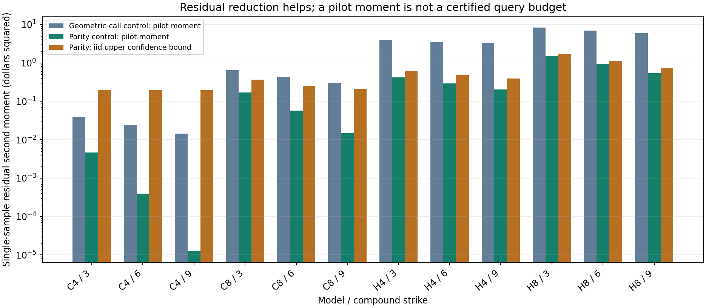

# Controlled-residual follow-up: findings and decision

Executed 22 September 2026. See the [frozen protocol](PROTOCOL.md),
[pre-acquisition parity extension](PARITY_EXTENSION.md),
[derivation](DERIVATION.md), [source check](SOURCES.md), and
[reproduction instructions](../../research/controlled_residual_feasibility/README.md).
The earlier manuscript and compound experiment are unchanged.

## Decision

**No defensible significant quantum advantage established yet.**

The hypothesis partially succeeds mathematically: proved conditional controls
and a put-call-parity decomposition make the residual substantially smaller,
bounded, and amenable to a flat quantum mean estimator. This is a real change
from the earlier expensive quantum-inside-quantum construction.

It does not pass the significant-advantage test. The controls improve classical
pricing too; bounding the residual and exercise error costs useful classical
work; the explicit coherent estimator still has a large resource count. Even
very favorable alternative query-count sensitivities miss the runtime budget
on the representative cases when they retain the statistically justified
moment and current arithmetic. A favorable isolated pilot-based corner is
disclosed below; it is neither a complete algorithm nor an advantage result.

**Stop this implementation before full quantum compilation or held-out
confirmation.** Retain the bounded-residual derivation and improved classical
baseline. This rejects the constructed implementation, not all quantum mean
estimators, all future arithmetic circuits, or all compound financial models.

## What changed in the algorithm

The output is still a call on the conditional value of the same arithmetic
Asian-basket call, with the same twelve development contracts: four/eight
assets, twelve/twenty-four monitoring dates, volatilities20%/40%, maturities
one/three years, and compound strikes3/6/9. Exact GBM transitions at monitoring
dates remain. No harder model or weaker classical comparator was substituted.

First we derived analytic conditional and global second-moment bounds for the
arithmetic-minus-geometric capped-call residual. The global flat-residual
second-moment bounds are0.7862,13.3167,31.0898 and118.4136 dollars squared for
C4,C8,H4,H8. They are population formulas, not estimates from sampled maxima.
Conditional continuation intervals localize states where the policy can be
wrong, but their simple regret envelopes remain loose in stressed cases.

The stronger extension uses parity. If A,G are future arithmetic/geometric
averages, a is accrued contribution, q=exp(-r(T-tau))/2 and k=2(K-a), set

    F = q(E[A|X]-k),  Pg = q E[(k-G)+|X],
    R = q[(k-G)+-(k-A)+],  C = F+Pg-E[R|X].

R is nonnegative and bounded by exp(-r(T-tau))*K. This identity targets the
original UNCAPPED option; the residual itself is bounded. It avoids confusing
a bounded residual with a bounded underlying price.

Clip the independent continuation approximation V into a proved interval for C.
For d=1(V>Kc), define Y=d(F+Pg-V-R). Then

    P = exp(-r*tau) * { E[(V-Kc)+] + E[Y] + E[regret] },
    regret = (C-Kc)+ - d(C-Kc) >= 0.

Y is bounded. Its conditional moment can be bounded by the lesser of an
arithmetic/geometric spread moment and a lognormal geometric-put moment,
including the centering cross term. The last expectation is essential: simply
dropping it would price a fixed exercise policy instead of the requested option.
At accuracy tending to zero, a fixed nonzero regret cannot be ignored. Thus
flattening at penny accuracy is not a new unconditional asymptotic theorem for
the full compound price.

## Executed residual results

Both pilots used sixteen independent RQMC randomizations,1,024 outer states and
2,048 inner scenarios, with distinct seed roots. All twelve contracts were run.
Representative results at compound strike6, before the outer discount:

| Model | Original geometric-control flat residual moment | Parity residual moment | Reduction | Statistically valid parity moment upper bound |
|---|---:|---:|---:|---:|
| C4 | .0238710 | .00039455 |60.5x | .194481 |
| C8 | .430026 | .0569290 |7.55x | .252908 |
| H4 |3.55959 | .292382 |12.2x | .480470 |
| H8 |6.98956 | .942924 |7.41x |1.127922 |

The first two moment columns are pilot estimates, not certificates. The final
column comes from a separate, predeclared fixed-N iid experiment:1,048,576
outer states per model and sixteen disjoint independent inner paths per state.
It combines two upper bounds with a split failure budget totaling0.001 per
price. One bounds the expectation of the analytic conditional envelope; the
other bounds the directly sampled single-path second moment. Squaring an inner
mean would give the wrong moment for the quantum source and was not used.

The confidence-bound floor is conspicuous in C4. A very small observed moment
does not eliminate the finite-sample support term. Zero observations also do
not imply zero uncertainty. These are valid sampling inequalities under ideal
iid/real-evaluation premises, not complete PRNG/floating-point certificates.

## Does localization remove the nested correction?

For a conditionally unbiased continuation estimate Z, convexity gives
E[regret]<=E[(Z-Kc)+-d(Z-Kc)]. This nonnegative upper estimator is bounded for
the parity construction. The same fixed-N experiment supplies a0.001-failure
upper bound on its discounted mean.

| Model | Regret upper, Kc3 | Regret upper, Kc6 | Regret upper, Kc9 | Allocated $0.003 budget |
|---|---:|---:|---:|---|
| C4 | .001904 | .001805 | .001793 | All three pass |
| C8 | .003643 | .002547 | .002046 | Two pass |
| H4 | .003404 | .002805 | .002526 | Two pass |
| H8 | .009067 | .006818 | .005056 | None pass |

Seven of twelve pass this particular bias gate. A failure here is **not** proof
the true policy regret is large: the sixteen-path Jensen estimator also has an
inner-sampling excess. The2,048-path pilot suggests much smaller gaps, but that
suggestion is not substituted into a rigorous schedule. More inner sampling or
sharper analytic bounds could tighten this certificate; doing so cannot rescue
the already failed resource screen and was not extended into a costly search.

The certificate acquisition, including prior independent policy training, took
75.11s(C4),134.86s(C8),72.29s(H4) and254.72s(H8). Those times belong to the
hybrid algorithm if it uses these bounds. They are not free classical inputs.
The same acquisition estimates the residual mean classically, illustrating why
fair preprocessing accounting is decisive.

## Strong classical comparison

Fresh32-replicate RQMC price calculations used8,192 outer states and either
sixteen or256 inner scenarios. They include both endpoints of the policy/Jensen
price bracket and target the uncapped model directly. All twelve256-inner
intervals have radius below$0.01. Every interval in both allocations overlaps
the independent archived reference interval. These checks are development
evidence, not simultaneous coverage validation or held-out confirmation.

Fresh-process timings were acquired AFTER other numerical acquisitions ended:

| Configuration | New parity method, full cold time | Largest empirical99% radius across three strikes | Classical time retained for crossover |
|---|---:|---:|---:|
| C4,16 inner paths |11.106s | .001462 |11.106s |
| H8,256 inner paths |21.186s | .002220 |13.847s, earlier valid implementation |

Each time includes imports, fresh native-code cache, policy training/validation,
state/path preparation, analytic bounds/controls, all three prices and output.
The entire three-price time is conservatively charged to a single requested
price. The new H8 control improves uncertainty but its additional calculation
cost does not improve the earlier penny-accuracy latency. We retain the faster
valid classical comparator instead of selecting a slower one for the quantum
comparison. These are individual timing acquisitions, not latency distributions.

The earlier C4 fixed-iid full-price experiment also remains a relevant stricter
statistical comparator:267.84s with penny sampling bounds. The current quantum
construction does not beat that contract either. No GPU, kernel quadrature or
new sparse-grid competitor was needed to defeat the constructed quantum method;
those remain eligible stronger classical alternatives if a future method passes.

## Quantum schedule and crossover

For the prospective penny-price contract, the allocations were fixed before the
iid run:$.003 for the surrogate mean,$.002 for the flat residual,$.003 for
exercise regret and$.002 for numerical errors. Failure budgets total.01:
.002 surrogate,.001 moment,.001 regret,.004 quantum estimation,.002 physical.
The surrogate and numerical/physical guarantees are still obligations, not
completed evidence.

The explicit signed dyadic mean-estimation schedule uses the statistically
bounded second moment, source and inverse calls, and confidence amplification.
It replaces the previous nested estimator, but estimates only the flat term.
At strike6 and32 fractional bits:

| Model | Explicit source/inverse calls | Path-arithmetic T subtotal | Ideal unit-constant queries |
|---|---:|---:|---:|
| C4 |14,745,150 |6.407e15 |218 |
| C8 |13,106,800 |1.140e16 |248 |
| H4 |26,214,000 |1.140e16 |332 |
| H8 |22,937,250 |3.983e16 |508 |

The subtotal composes existing emitted path-generation arithmetic for both
halves of a trajectory. It omits the new parity payoff, analytic CDF/control,
policy, bin-selector, synthesis, routing and measurement costs. It is favorable
to the quantum proposal and is not a full emitted circuit or physical estimate.

The last column takes ceil(sqrt(moment)/allocated_error), with coefficient one
and no confidence/logarithmic/additional-inverse factors. This is an optimistic
sensitivity coordinate, **not** a compiled Kothari–O'Donnell algorithm and **not**
a lower bound on all quantum algorithms. The explicit dyadic implementation is
conservative; its loss does not refute optimal source-query theory.

For a10x win, total quantum latency must be at most1.111s(C4) or1.385s(H8).
Even granting a free baseline, free regret control and zero quantum setup, the
ideal counts allow only:

| Model, Kc6 | Entire coherent-source budget | Time if each ideal query costs only ONE current exponential, at100ns/T layer |
|---|---:|---:|
| C4 |5.09ms |56.60s |
| H8 |2.73ms |131.89s |

One current exponential has2,596,296 dependency T layers. All other trajectory
operations, geometric evaluation, policy arithmetic, inverses and extraction
are treated as free in this deliberately generous screen. The real source
requires more work. The classical preprocessing alone also exceeds the full
10x budget. Even the stricter C4 classical267.84s contract gives only26.784s
for a10x quantum win, below the56.60s one-exponential sensitivity and75.11s
preprocessing acquisition separately.

The archived sensitivity includes24/32 fractional bits and1/10/100/1000ns per
T layer. These are hypothetical logical-layer times, not measured hardware
cycles. A single-exponential ideal calculation at1ns can fit selected budgets;
this does not map a physically realizable complete oracle or explicit
confidence-amplified estimator. We therefore do not turn it into a level2 claim.

### The optimistic corner, explicitly retained

If one inserts the UNCERTIFIED pilot moment instead, assumes unit query
constants and makes everything but one exponential free, C4,strike9 requires
two ideal queries and0.519s at100ns/T layer. That fits its1.111s numerical
budget. It is an informative sensitivity, not a result we discard silently.

It omits the complete source, inversion/confidence constants, baseline mean,
regret treatment, numerical proof and bound acquisition. Moreover, the iid
calculation bounds the combined absolute flat-mean and regret contribution in
this case by$.005083 with at least99.7% sampling confidence. Once that
information is available, classical pricing can omit that correction at penny
accuracy if the remaining surrogate-mean/numerical budget is met. There is no
demonstrated quantum-required correction to accelerate in this favorable corner.

Kothari–O'Donnell does not fundamentally require our costly classical variance
certification procedure. A different explicit algorithm might avoid it. That
possibility is retained, but neither its constants nor an affordable full source
have been implemented here. We do not treat the preprocessing time as a lower
bound applying to every possible quantum estimator.

## Claim ledger

| Claim | Status |
|---|---|
| Exact parity decomposition, conditional moments, bounded residual and explicit regret term | Derived; independent algebra/quadrature/enumeration tests |
| Lower residual moments on all twelve development contracts | Executed pilot evidence; not novelty or advantage |
| Fixed-N statistical moment/regret upper bounds | Executed; exact iid/real-evaluation premises, per-price failure accounting |
| Exercise-regret omission within the assigned budget | Established statistically for7/12; not for the other5 |
| Strong classical penny pricing with the same controls | Executed, empirical endpoint intervals; independent-reference agreement |
| Much lower cost than our earlier quantum nested construction | Favorable implementation-level comparison only; outputs/corrections are explicitly separated |
| Generic quantum mean-query speedup | Established literature under source access; not a lower bound against structured classical finance algorithms |
| Conditional end-to-end fault-tolerant advantage | Not established |
| Demonstrated hardware advantage | Not attempted |
| Impossibility of all quantum controlled-residual methods | Not established |
| Novel theorem or publishable novelty from these standard controls | Not established |

## What would change the decision?

A future proposal must supply an explicit estimator/source combination, not
just a smaller empirical variance. It must satisfy the full price error/failure
budget, include baseline and preparation costs, and remain faster when the
classical method receives the same controls and reuse.

For orientation, even the favorable C4/H8 strike6 screens need complete
coherent sources below roughly5ms/3ms before overhead, together with a mean
estimator much closer to the ideal schedule than the current dyadic one.
Those are necessary coordinates for that idealized design, not sufficient
acceptance criteria. Current single exponential depth already exceeds them
under the100ns scenario. Alternatively, a financially justified workload must
make strong classical pricing much more expensive without increasing coherent
cost comparably. Neither requirement has been demonstrated.

Do not launch a larger financial parameter sweep or rewrite the paper's claims
on this evidence. If pursuing another quantum attempt, the next decisive
deliverable is a measured/compiled **complete controlled source plus an explicit
modern mean-estimation schedule** meeting a predeclared budget. Further variance
pilots alone are unlikely to change the decision. A new compiler/source method
would need its own justification; it is not promised as a rescue.

## Reproducibility and scope limits

All raw replicate summaries, representative state arrays, fixed-N plans,
statistical summaries, schedules, sensitivity tables, fresh-process receipts and
plots are retained under `results/controlled_residual_feasibility`. Protocols
preceded their corresponding acquisitions; the parity extension is documented
as development, with fresh roots. Existing controls and reference data remain.

Tests and source/artifact hashes are recorded in `validation_v1`. No held-out
advantage case was opened. No quantum device, full parity finance circuit,
normal-CDF synthesis, physical layout or fault-tolerant decoder was implemented.
Finite-input/arithmetic error bridges remain open. Stopping before those costly
steps is justified by the failed feasibility gate, not presented as completed
hardware engineering.
