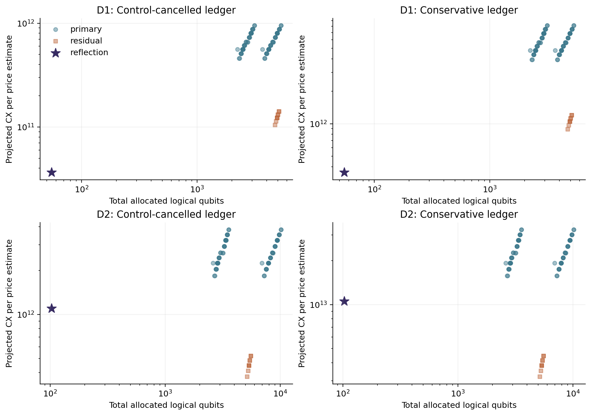
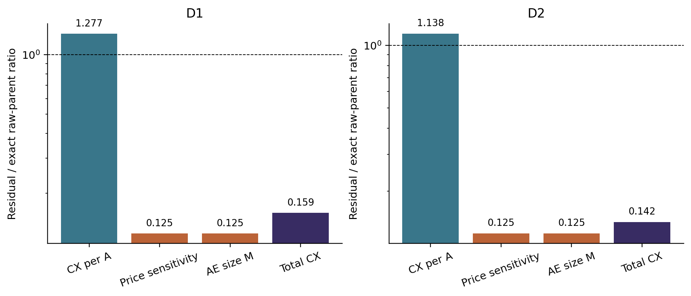
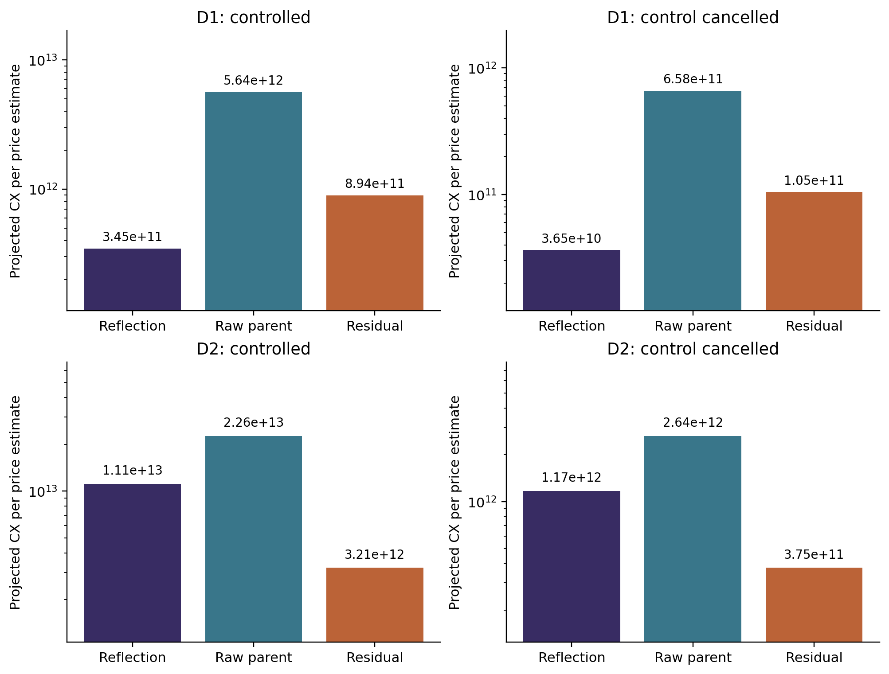

# Classical controls and compiler policy in quantum Asian-basket pricing: a certified comparative study

Research manuscript draft, 22 September 2026. AI-assisted research and writing;
author names, affiliations, human approval and submission information are not
asserted. This document reports ideal-logical resource projections, not a
hardware experiment. D1 and D2 are development cases, not fresh confirmation.

## Abstract

Quantum pricing comparisons depend on the cost of a coherent payoff oracle and
the normalization that converts an estimated probability into a price. We study
that interaction for two discretely monitored arithmetic Asian-basket calls,
comparing a shared-reflection quantum signal processing construction with
reversible fixed-point arithmetic. Both are evaluated under a one-dollar
absolute-error contract with at least 95% confidence in a declared ideal-logical
model. Directed certificates connect continuous Gaussian inputs to finite
midpoint laws, arithmetic or polynomial errors, state preparation and numerical
decoding. A frozen arithmetic study contains 148 layout rows and 18 signed
residual configurations. Supplying arithmetic with a comparable degree-four
classical control reverses the projected logical-CX ordering in the two-asset
case: historically, reflection requires 2.9346 times the residual arithmetic
projection under one ledger and 3.2892 under a conservative alternative. A
separate six-oracle comparison under a common, unoptimized ideal U/CX policy
preserves the ordering, with corresponding ratios 3.1290 and 3.4732. Reflection remains
lower-CX in the one-asset case. The residual implementation allocates 5,162
qubits versus 103 for reflection in the two-asset case. Against its identical
raw-arithmetic parent, the residual oracle costs 13.78% more per preparation
but requires an eightfold smaller amplitude-estimation size. The contribution
is an auditable comparative finding and a worked error/resource contract,
not a new control-variate principle, universal encoding ranking, or evidence of
quantum-over-classical advantage. The common-policy counts describe ideal
decomposition identities; they do not certify a finite-precision transpiler's
output or physical execution. Comparable depth is a serial upper bound.

## 1. Introduction

Amplitude estimation changes the number of coherent oracle uses required for
expectation estimation. It does not make the oracle, its state preparation, or
the conversion between probability error and financial error free. A lower-cost
payoff circuit can therefore lose after normalization and the complete error
budget determine the number of repetitions and controlled powers. A comparison
is also incomplete if one implementation benefits from a classical control and
its competitor estimates the raw payoff.

We examine these issues in a small, explicit setting: two geometric-Brownian
arithmetic Asian-basket calls, with two monitoring dates, compared under fixed
accuracy, confidence, discretization and call limits. The study developed from
a comparison in which a reflection/QSP route used a polynomial classical
control while reversible arithmetic evaluated the raw payoff. We retain that
historical result and enlarge the arithmetic menu to include shared clean
workspace, range-reduced exponentiation and the corresponding signed residual.
The enlarged menu changes the D2 result. This is a correction to comparator
design with a measurable consequence, not evidence that the previous experiment
was invalid or that residual estimation is new.

Our contribution has three parts. First, we make the signed arithmetic and
price-error contract explicit, including signed floors, overflow, sum-to-basket
units, restoration of the finite-model control expectation and numerical
decoding. Second, we retain and replay the complete declared menu rather than
reporting only winning rows. Third, we decompose the observed reversal into
per-oracle cost, normalization, dyadic amplitude-estimation demand and width.
The relevant unit of evidence is a specified implementation under a specified
resource policy. We do not interpret a ratio of resource projections as a
bound on the ratio of optimally compiled circuits or execution times.

## 2. Related work and scope of originality

Classical approximation followed by quantum integration of the residual is
explicit in Novak's equation (25) [1, §3]. The present control identity is an
application of that principle, not a new quantum variance-reduction primitive.
Montanaro's signed and bounded-variance mean-estimation constructions provide
further established context [2, §2.3, Algorithm 3 and Theorem 5]. Stamatopoulos
and Zeng describe a QSP pricing pipeline and shifted uniform comparison for
digital payoff values [3, §§3–5, especially equations (20)–(27)]. The affine
shift used below is therefore also established.

Asian and basket pricing with amplitude estimation predates this study [4,
§§4.2.1–4.2.2, equations (25)–(35)]. Prakash et al. give both nested and
arithmetic constructions, including coherent averaging followed by final
amplitude estimation [5, §5, equations (70)–(73), Theorem 5.1]. Avoiding an
inner amplitude-estimation call is consequently insufficient to establish
novelty. The dependence of query demand on payoff normalization is discussed
directly by Cibrario et al. [6, §IV-A, equation (25), and §IV-E]. Our ordering
change is a concrete instance of that dependence.

Integrated pricing-resource/error analysis is also established. Chakrabarti
et al. account for arithmetic and approximation errors in fault-tolerant pricing
estimates [7, §4.2, equation (42), Appendix C]. Herman et al. formulate a recent
truncation/discretization/arithmetic/loading/error framework [8, §§4.2–4.3,
Theorem 4.1]. Their discretizations and hardware or oracle assumptions differ
from ours, so their numerical estimates cannot be transferred directly.

Reversible polynomial evaluation and memory management are standard tools.
Häner et al. study polynomial arithmetic and piecewise function approximation
[9, §III and Appendices A–B]; Meuli et al. explicitly formulate reversible
pebbling for memory management [10]. Shared scratch is an implementation
optimization within that tradition. Stronger piecewise/minimax exponentiation
or a different pebbling schedule could change our menu's ranking. The recent
Fourier-arithmetic pricing manuscript of Kim et al. concerns aggregation of
digitized prices [11, §3 and Appendix A]; its aggregation comparison does not
replace a Gaussian-to-price, signed-payoff and complete-AE comparison.

For classical context, conditional and active-subspace quasi-Monte Carlo are
strong relevant comparators [12, §3, Theorem 3.2, §5, equations (15)–(16);
13, §3, Theorem 3.1 and Algorithm 1]. We retain the project's classical
diagnostics but do not claim a rigorous-confidence end-to-end race against
them. State preparation is charged explicitly; Herbert's analysis [14] warns
against importing a query advantage while hiding the preparation procedure.
It is not a general impossibility theorem for analytic finite-law preparation.

The narrow original candidate is the particular application construction and
the reproducible matched-comparator finding. The literature assessment does
not establish world-first priority. It distinguishes an empirical/methodological
contribution from a new primitive or abstract complexity theorem.

## 3. Financial target and finite model

Let there be $n_a$ assets and $n_t$ equally weighted observation dates,
with $d=n_a n_t$. Under risk-neutral correlated geometric Brownian motion,
write the asset/date values in flattened order as

$$
 S_i(Z)=\exp(\mu_i+F_i Z),\quad Z\sim N(0,I_d),\qquad
 A(Z)=d^{-1}\sum_{i=1}^{d}S_i(Z),\qquad
 V=D\,\mathbb E[(A(Z)-K)_+],\quad D=e^{-rT}.
\tag{1}
$$

The initial spot is 100, $r=0.03$, and $T=1$, with observation dates
0.5 and 1 year. D1 has one asset, two
dates, volatility 0.20 and strike 95. D2 has two assets, two dates, volatility
0.25, strike 105 and cross-asset correlation 0.40. The D1 correlation parameter
0.30 is vacuous for one asset. The complete archived contract and factorization
are authoritative; the stored PCA orientation is pinned rather than assumed
invariant across numerical libraries.

Before the stored-parameter bridge, the log mean for asset/date pair $(a,t)$
is $\log(100)+(r-\sigma^2/2)t$, and its covariance with $(b,u)$ is
$\sigma^2\rho_{ab}\min(t,u)$, where $\rho_{aa}=1$ and distinct-asset
correlation is the stated constant. The factor $F$ is the archived PCA
square root of that covariance.

For each independent normal coordinate, truncate at $c=4$, partition
$[-c,c]$ into $2^q$ equal cells with $q=10$, and use the midpoint
of each cell. Its probability is the exact normal cell mass conditional on
$[-c,c]$. Coordinates remain independent under this product finite law.
Denote expectation under it by $\mathbb E_q$ and its option price by

$$
 V_q=D\,\mathbb E_q[(A-K)_+].
\tag{2}
$$

The computation targets this finite law, with a separately certified tail,
midpoint and stored-model bridge to (1). Archived binary64 means, factors and
other constants are interpreted as exact binary values when certifying their
implementation; differences from declared real financial parameters are
charged separately. “Continuous target” refers to Gaussian inputs in (1),
not to continuous monitoring between the two contract dates.

## 4. Coherent constructions

### 4.1 Shared-reflection signal and QSP

The reflection construction uses separability of each lognormal term over the
Gaussian coordinates to build a row-indexed signal, then combines the rows
using shared conjugation and a signed linear combination. For nonnegative
weights $c_i$, nonnegative strike $K$, and $t_i\in[0,1]$, excluding
the identically zero case $C_\Sigma=K=0$, the affine signal
$\sum_i c_i t_i-K$ has independent-cube normalization

$$
 \alpha_*=\max(K,|C_\Sigma-K|)=C_\Sigma/2+|C_\Sigma/2-K|,
 \qquad C_\Sigma=\sum_i c_i.
\tag{3}
$$

A contraction gives the lower bound, and the row-reflection linear combination
with coefficients $c_i/2$ and $C_\Sigma/2-K$ attains it. This is a
restricted consequence of standard block-encoding/LCU constructions [15,
§3.1, equations (8)–(10), Lemma 5; 16, §4.3, Definition 51 and Lemma 52].
It is not normalization optimality for the actual correlated model support.
For example, fixing $t=1,C_\Sigma=1,K=3/4$ gives norm $1/4$, below the
cube bound $3/4$. Negative weights and the zero-normalization case are
outside (3); the identically zero payoff needs no division.

Let $B>0$ certify $|A-K|\le B$ on the cutoff cube and put
$x=(A-K)/B$. A degree-four classical polynomial control is defined below.
The reflection route implements a higher-degree QSP approximation to the
remaining normalized function. Its Hadamard readout probability is
$a_{\rm ref}=(1-\operatorname{Re}\mathbb E_q[U_{\rm QSP}])/2$.
The price decoder has the form

$$
 \widehat V_{\rm ref}=O+\beta(1-2\widehat a_{\rm ref}).
\tag{4}
$$

Here $O$ is the finite-model control offset and $\beta$ is the
archived residual scale including discount. Probability-to-dollar sensitivity
is $L_{\rm ref}=2\beta$. The residual QSP scale is not identified with
the signed arithmetic bound below: the approximants and their budgets differ.
Signal, phase-response, polynomial, projector, radius, loading, offset and
floating-point errors appear separately in the reflection certificate.

### 4.2 Raw reversible arithmetic

The raw route prepares the same finite Gaussian law and reversibly computes
the logarithms, exponentials, sum, positive part and selector threshold. With
signed width $w$ and scale $Q=2^f$, range reduction divides the log input
by $2^s$, evaluates a quantized Taylor polynomial, then squares $s$ times.
For either sign of an integer $X$,

$$
0\le \frac{X}{2^sQ}-\frac{\lfloor X/2^s\rfloor}{Q}
 \le \frac{2^s-1}{2^sQ}.
\tag{5}
$$

If an intermediate value has magnitude bound $B_e$ and approximation error
$e$, a rounded squaring contributes at most
$2B_e e+e^2+Q^{-1}$. These bounds propagate through exact integer spot
scaling. Full products, retained words, sums and selector ranges are checked.
The scratch-reuse layout cleans workspace coherently before another spot uses
it. Compute/uncompute operations remain charged; smaller allocation does not
imply smaller depth.

### 4.3 Signed residual arithmetic and the offset

Let $p_4(x)=\sum_{k=0}^4 c_kT_k(x)$ be the archived Chebyshev polynomial,
and define

$$
g(x)=\frac{x+p_4(x)}2,\quad C(A)=Bg(x),\quad
r(A)=(A-K)_+-C(A)=\frac B2(|x|-p_4(x)).
\tag{6}
$$

The degree-four truncation coefficients of $|x|$ are
$(2/\pi,0,4/(3\pi),0,-4/(15\pi))$. For the exact stored-coefficient
discrepancy $\eta=\sum_k|c_k-c_k^*|$, the tail identity
$\sum_{j\ge3}4/[\pi(4j^2-1)]=2/(5\pi)$ yields

$$
 |r(A)|\le B\rho,\qquad \rho=\frac1{5\pi}+\frac\eta2.
\tag{7}
$$

This is a normalization bound, not an additive pricing bias. We estimate the
residual and restore the control expectation. At $A=K$, the stored
polynomial gives a negative residual; at $x=1$ it gives a positive one.
These are domain witnesses, not claims that both points occur on each finite
grid. Clipping or unsigned reinterpretation would change the target.

The implemented control uses $w=48,f=24$. Write the exact monomial
coefficients of $g$ as $b_j$, set
$k=\lfloor Q/(dB)\rfloor$, $a_j=\lfloor Qb_j\rfloor$, and
$S=\lfloor QdB\rfloor$. If $\Delta_{\rm int}$ is the sum of the spot integers minus
$dKQ$, the map is

$$
X=\lfloor\Delta_{\rm int} k/Q\rfloor,\quad Y_4=a_4,\quad
Y_j=\lfloor XY_{j+1}/Q\rfloor+a_j,\quad
R_{\rm int}=\max(\Delta_{\rm int},0)-\lfloor Y_0S/Q\rfloor.
\tag{8}
$$

All floors are signed floors, including negative products. $R_{\rm int}$
is sum-scaled: its corresponding basket residual is $R_{\rm int}/(dQ)$.
Inputs and all work registers are restored where required by the oracle.

Let $E$ bound each parent spot's absolute error, $u=Q^{-1}$,
$\epsilon_k=|k/Q-1/(dB)|$, and $\epsilon_S=|S/Q-dB|$. Set

$$
 \Delta_x=E/B+d(B+E)\epsilon_k+u,\quad R=1+\Delta_x,
\quad \delta_j=|b_j-a_j/Q|,
$$
$$
h_4=\delta_4,\quad h_j=Rh_{j+1}+u+\delta_j,\quad
L_g=\sum_{j=1}^4j|b_j|R^{j-1},\quad G=\sum_{j=0}^4|b_j|R^j.
\tag{9}
$$

Then the sum-scaled control and residual errors satisfy

$$
 E_C=dB(L_g\Delta_x+h_0)+\epsilon_S(G+h_0)+u,\qquad
 E_R=dE+E_C,\qquad
 |R_{\rm int}/Q-dr(A)|\le E_R.
\tag{10}
$$

The first term follows by the mean-value bound and Horner error recurrence;
positive part is 1-Lipschitz, giving the $dE$ contribution. Thus the
arithmetic price allowance is $DE_R/d$. Adding the parent's arithmetic
error again would double count it.

Directed interval propagation checks signed 48-bit retained words and 96-bit
full products before additions. Establishing the unbounded reference range
first avoids assuming the absence of modular overflow. Integrality permits

$$
J=\lfloor\operatorname{upper}(Q(dB\rho+E_R))\rfloor,
\quad H=2^{\operatorname{bitlength}(J)},\quad 2^m=2H.
\tag{11}
$$

Since $|R_{\rm int}|\le J<H$, a uniform $m$-bit selector $U$
gives the exact probability

$$
a_{\rm ar}=\Pr(U<R_{\rm int}+H)
=\frac{\mathbb E_q[R_{\rm int}]+H}{2^m}.
\tag{12}
$$

There is no extra threshold-discretization bias. The decoded price is

$$
\widehat V_{\rm ar}=O-\frac{DH}{dQ}+L_{\rm ar}\widehat a_{\rm ar},
\qquad L_{\rm ar}=\frac{D2^m}{dQ}.
\tag{13}
$$

The offset $O$ encloses the same finite-law control expectation, using
moments through degree four and product structure rather than enumerating
the $2^{qd}$ grid. Its stored-discount versus real-discount discrepancy is
charged separately. Model/hash binding is necessary provenance, but is not a
substitute for replaying the expectation enclosure.

## 5. Accuracy and confidence contract

Each route uses a deterministic dollar envelope $E_{\rm det}$ that includes
representation, approximation/arithmetic, loading, control offset, relevant
constant bridges and numerical decoding. These are absolute upper allowances,
not fitted standard deviations. For arithmetic, a marginal-loader state error
$\epsilon_{\rm loader}$ contributes at most
$2L_{\rm ar}d\epsilon_{\rm loader}$, by product-state telescoping and
the probability perturbation bound. The offset itself has no loader sensitivity.
Reflection uses its separately derived response-sensitive preparation bound.

**Price guarantee under the declared ideal model.** Suppose the deterministic
certificate for the route is valid, the unitary and its inverse and controlled
powers are ideal, and the 17 AE trials are independent. For probability-to-price
Lipschitz constant $L$, choose a dyadic $M$ such that

$$
E_{\rm det}+L\left(\frac\pi M+\frac{\pi^2}{M^2}\right)\le1.
\tag{14}
$$

The median decoded estimate then has absolute error at most one dollar with
probability at least 0.95. Indeed, canonical AE [17, Theorem 12] has amplitude
error at most $2\pi\sqrt{a(1-a)}/M+\pi^2/M^2$, bounded uniformly by the
parenthesis in (14), with success at least $8/\pi^2>0.8$. Hoeffding's
inequality bounds median failure by $e^{-2(0.8-0.5)^2 17}=e^{-3.06}<0.05$.
The triangle inequality and the affine decoder complete the argument. The
guarantee is a composition of established bounds, not a new AE theorem.

Each trial has $2M-1$ uses of preparation or inverse, so the declared call
count is $17(2M-1)$, constrained to at most ten million. The planner does
not retune this convention using a tighter binomial confidence calculation.

The frozen arithmetic decoder certificate assumes a binary64 amplitude input,
whereas a canonical AE label represents the real number
$\sin^2(\pi y/M)$. A later, separately versioned interface adapter encloses
that number with directed trigonometry, chooses a float and certifies its
distance from the enclosure. Sorted endpoint medians give an enclosure for
the exact median; multiplying its discrepancy by $L$ adds a valid dollar
allowance. Exhaustive checks of 384 possible labels for $M=128,256$ and all
18 residual schedules add approximately $1.70\times10^{-15}$ dollars in
D1 and $3.42\times10^{-15}$ in D2. No schedule changes. This repairs a
classical numerical interface without modifying frozen producers or claiming
physical implementation accuracy.

## 6. Resource policy and study design

The historical study fixes the contracts, cutoff, grid, accuracy/confidence
contract and call cap. It retains 74 primary acquisitions under two workspace
layouts (148 rows), plus 18 signed-residual configurations. The primary menu
includes width/precision choices and Taylor degree/reduction choices; the
residual menu fixes $w=48,f=24$, degree in $\{8,12,16\}$ and reduction
in $\{1,2,3\}$, separately for D1/D2. Selection takes the lowest supplied
CX projection among certified feasible rows. It has no global-optimality claim.

Arithmetic counts stream exact X/CX/CCX components, with one logical U per X
and six CX plus nine U per CCX. Reflection uses compiled logical U/CX
components. Two complete-AE ledgers account for conservative gate control or
standard control cancellation, respectively. Both charge initial preparation,
oracle/inverse work, zero-state reflections and inverse-QFT swaps. Allocation
includes retained clean work and phase-estimation wires. Physical routing,
native approximation, error correction and elapsed hardware time are absent.

Identical basis names do not imply identical compiler optimization. Historical
reflection components underwent optimization while arithmetic used streamed
decomposition. Furthermore, primary depth is remapped dependency depth and
the residual depth field is a serial composition upper bound. They are not
interchangeable depth measurements. The separately frozen six-oracle follow-up
is reported in Section 7.3 with its actual compiler scope and limitations.

Repeated nominal degrees do not necessarily represent distinct circuits.
Quantization makes some degree-12/16 coefficient sequences identical; effective
degree is 9 at $f=20$ and 10 at $f=24$. The 74 primary acquisitions form
50 conversion-map groups, and the 18 residual rows form 12 circuit groups.
Their separate certificates/layouts remain retained. We do not describe 166
rows as 166 independent circuit families.

## 7. Results

### 7.1 Complete-menu historical comparison

Table 1 reports the selected plans in the historical control-cancelled ledger.
Deterministic allowances precede the negligible later label-adapter addition.
All use 17 AE trials. The raw minima use $w=40,f=20$, Taylor degree 8 and
one range reduction/squaring; residual minima use $w=48,f=24$ with the
same nominal exponential degree and reduction.

| Case and route | Deterministic allowance (\$) | M | Projected CX | Allocated qubits |
| --- | ---: | ---: | ---: | ---: |
| D1 reflection, QSP degree 64 | 0.45473744 | 128 | 36,469,403,102 | 55 |
| D1 selected raw arithmetic | 0.10284620 | 1,024 | 458,928,511,243 | 2,314 |
| D1 selected residual arithmetic | 0.10296484 | 128 | 104,719,289,723 | 4,733 |
| D2 reflection, QSP degree 128 | 0.60039730 | 512 | 1,101,392,680,835 | 103 |
| D2 selected raw arithmetic | 0.19044330 | 2,048 | 1,843,424,312,811 | 2,687 |
| D2 selected residual arithmetic | 0.20538904 | 256 | 375,312,500,844 | 5,162 |

Table 1. Historical selected logical-resource projections. These are neither
execution measurements nor lower bounds on achievable cost.

The [generated selected-plan table](artifacts/historical_v1/historical_selected.md)
also includes the exact raw parents and both ledgers; the
[complete 166-row export](artifacts/historical_v1/historical_all_166.csv)
retains the full menu.

Figure 1. Eligible archived arithmetic rows and selected reflection references
under the historical policies; all 166 arithmetic rows are feasible in the
frozen study. Identical/overlapping rows are retained in the source
table; visible point count is not a count of independent circuit families.
Both axes concern declared logical resources, with no runtime interpretation.
[Vector PDF](artifacts/historical_v1/historical_width_cost.pdf).

Reflection wins D1 within this menu; residual arithmetic wins D2. D2's
reflection/residual CX ratio is 2.93460 with control cancellation and 3.28916
in the conservative ledger. The residual width is about 50.1 times reflection's
in D2 and 86.1 times in D1. A width cap below 5,162 excludes the selected D2
residual route irrespective of its CX saving.

### 7.2 Mechanism and sensitivity

Minimum-to-minimum raw/residual ratios change both precision and oracle
structure. For a more controlled decomposition we instead use the exact raw
parent of the selected residual, with $w=48,f=24$, degree 8 and reduction
1. In D2 its preparation CX rises from 37,964,541 to 43,196,209 after adding
the signed control, an increase of 13.78%. Probability-to-price slope falls
from approximately 496.868 to 62.1085, and $M$ falls from 2,048 to 256.
Projected complete CX falls from 2,643,233,541,099 to 375,312,500,844, a factor
of 7.04275. The benefit is fewer expensive oracle uses, not a cheaper oracle.
This is an archived matched-parent decomposition, not an experiment isolating
centering from all consequent oracle changes.

Figure 2. Residual/raw-parent ratios for preparation CX, probability-to-price
slope, AE size and complete control-cancelled CX, holding the exponential
precision/degree/reduction fixed. The residual preparation becomes more
expensive in both cases while query demand falls. The source values are in the
[generated ratio table](artifacts/historical_v1/matched_parent_ratios.md).
[Vector PDF](artifacts/historical_v1/matched_parent_mechanism.pdf).

The D2 residual schedule leaves about \$0.0230714 of unused margin, compared
with \$0.135967 for reflection. A hypothetical common extra \$0.025 deterministic
allowance doubles the residual $M$ to 512 and leaves reflection at 512.
Holding these oracles fixed, the residual still wins the projection by a
factor 1.46587. This is a sensitivity calculation, not a physical-noise model,
menu-wide reoptimization or new confirmation. The numerical label correction
is many orders of magnitude smaller.

The classical control is not free. Its archived preparation records 28,672
cell visits and 70 exponential evaluations for D1, and 245,760 and 549 for
D2, with 1,025 CDF boundaries per case. These counts are reported separately;
we do not add CPU operations to CX or infer a wall-clock speedup.

### 7.3 Bounded common-policy follow-up

The separately frozen follow-up compares exactly six implementations: reflection
degrees 64/128, the selected residuals, and their raw parents `D1_28`/`D2_28`.
Both arithmetic routes use width 48, fractional precision 24, degree 8 and
reduction 1. The raw parents are **not** the lower-width historical raw minima
in Table 1. Contracts, grids, stored parameters, controls, error certificates,
AE sizes and repetition counts remain fixed; there is no new selection sweep.

Qiskit Terra 0.46.3 translates finite loader/signal/projector/reflection blocks
to U/CX with optimization level 0 and seed 717. Arithmetic X/CX/CCX streams are
re-emitted and translated using the same unoptimized decomposition. No old
optimized block counts enter the new results. Every controlled U is charged
five U and two CX, including one identity U padding; controlled CX uses nine U
and six CX. A controlled block's global phase contributes one U, including
explicit identity when its phase is zero. Inverses retain the counts. There
is no special-angle simplification, adjacent cancellation or identity removal.
The only permitted nonlocal rewrite is the control-cancellation identity for
the second AE ledger. Zero reflections, good-state CZ, Grover global phase,
phase-register Hadamards and inverse QFT including swaps are charged. Allocation
includes clean zero-reflection work, giving $2n_A-2+\log_2 M$ total wires for
an $n_A$-wire preparation.

This is a deliberately uniform resource policy, not an optimized compiler
competition. Its U/CX counts model exact ideal decomposition identities. Tiny
matrix tests check implementation and phases but do not certify all numerical
parameter arithmetic in a binary64 transpiler. Consequently the price
certificate remains conditional on ideal implementation of the certified
oracle; it does not establish that an exported native gate list attains the
same price guarantee. Clifford+T comparison is unavailable because a common
certified rotation-synthesis allowance has not been established.

| Case and fixed route | M | Allocated qubits | Control-cancelled CX | Fully controlled CX |
| --- | ---: | ---: | ---: | ---: |
| D1 reflection | 128 | 55 | 36,477,214,772 | 345,327,182,288 |
| D1 raw parent | 1,024 | 2,754 | 658,467,218,787 | 5,638,322,087,193 |
| D1 residual | 128 | 4,733 | 104,719,289,723 | 893,953,445,821 |
| D2 reflection | 512 | 103 | 1,174,336,099,955 | 11,146,299,105,743 |
| D2 raw parent | 2,048 | 3,191 | 2,643,233,541,099 | 22,636,125,188,209 |
| D2 residual | 256 | 5,162 | 375,312,500,844 | 3,209,243,659,974 |

Table 2. Complete six-oracle common-policy comparison. “Fully controlled”
denotes the conservative ledger controlling preparation and inverse;
“control-cancelled” applies their exact cancellation around controlled
reflections. Both charge the complete declared AE construction.

Reflection remains lower-CX in D1 and residual arithmetic remains lower-CX in
D2 under both ledgers. D2 reflection/residual ratios are 3.12895546 and
3.47318567, respectively. Arithmetic's control-cancelled totals reproduce
their historical values; the new reflection totals increase. In D2 the
reflection preparation gains 4,194,320 CX under the unoptimized policy,
propagating to 72,943,419,120 additional complete control-cancelled CX.
This reconciliation attributes the change to the declared compiler policy,
not to a new financial model or a retuned query schedule. The result supports
the ranking within this second explicit policy, not robustness to every
possible compiler or arithmetic design.

Figure 3. The six fixed implementations under both common-policy ledgers.
The raw route is the residual's exact parent, not the historical raw minimum.
[Vector PDF](artifacts/common_v1/common_policy_cost.pdf). Complete values,
per-preparation U/CX and serial depth bounds are in the
[generated table](artifacts/common_v1/common_selected.md); exact ratios are in
the [comparison table](artifacts/common_v1/common_comparisons.md).

For every route, serial depth is defined as U+CX, the depth of a deliberately
serial schedule. For example, D2's control-cancelled bounds are
3,229,367,906,697 for reflection and 857,099,192,503 for residual arithmetic.
These are comparable upper bounds under one schedule convention, not optimized
DAG depths or evidence of an execution-time or spacetime advantage.

The label interface was exhaustively evaluated at all 3,968 labels in the five
distinct fixed sizes 128, 256, 512, 1,024 and 2,048. All six schedules remain
feasible with the extra conversion allowance. The largest addition is about
$2.76\times10^{-14}$ dollars for D2 raw arithmetic; the smallest remaining
margin is about \$0.0230714 for D2 residual arithmetic. The
[error table](artifacts/common_v1/common_error_budget.md) retains exact rational
allowances and margins. This extends the interface check to reflection and raw
parents without changing the historical certificates.

The completed attempt used 380.8125 CPU seconds, 413.2307 wall seconds and
185,151,488 bytes peak RSS, below the fixed two-CPU-hour and 16-GiB limits.
These are acquisition/compiler costs, not quantum pricing runtime. Historical
offset preparation work is retained separately, and existing QSP phase
synthesis is reused rather than reacquired or assigned zero total cost.
An earlier attempt stopped before any complete row because a guard compared
tuple-valued regenerated data with JSON lists; its failure record is retained.
The corrected guard compares canonical JSON structure under a new source
freeze and exclusive output directory. No unsuccessful financial setting or
unfavorable resource row was removed.

## 8. Discussion and limitations

The reversal is principally a correction to an unmatched comparator. That
observation limits, rather than eliminates, its scientific use. It demonstrates
why a pricing-resource study should compare the classical control, probability
normalization and residual implementation as a complete choice. Reporting
per-call savings alone would miss the D2 mechanism; reporting CX alone would
hide the large width penalty. The fixed error contract also reveals that
dyadic query schedules can change discontinuously under small budget changes.

The decision procedure minimizes an explicitly supplied finite menu. This is
useful reproducible software, not a new optimization theorem. More generally,
if actual costs satisfy $T_i\le U_i$, comparing upper projections $U_i$
does not order the $T_i$: $U=(200,100)$ and $T=(10,90)$ provide a
counterexample. Our numerical ratios are ratios of the declared formulas.

Only two development contracts are studied. The result does not establish
prevalence across volatility, strike, maturity, dimension or precision, and
earlier tiny or unfavorable cases are not erased from the repository. No
fresh confirmation set is opened. More efficient arithmetic, different
pebbling, signal synthesis or state preparation may alter the comparison.
A common bounded compilation policy does not establish globally optimized
or best-in-class circuits.

The absolute gate projections are large, and neither native synthesis nor
physical failure probabilities are bounded here. A low-CX, high-width route
can lose in spacetime cost or elapsed time. Existing classical controlled and
conditional RQMC diagnostics are strong, but their replicate-t confidence
intervals are approximate and are not the same theorem contract as (14).
Consequently this study establishes neither a matched rigorous-confidence
classical crossover nor quantum advantage. A publication should be judged on
the comparative lesson and reproducibility, not on an implied commercial
pricing benefit.

## 9. Reproducibility and assessment provenance

The repository is [Prithvi8706/quantum_option_pricing](https://github.com/Prithvi8706/quantum_option_pricing).
Primary source freeze `9511bc0c8cb25421707428abec8ca8f22ba02cfc` precedes its
acquisition; signed-residual implementation `23f8d948` precedes acquisition
head `60e735e1783a9aadec2fe42acfc007c16030fac2`, which also publishes the
primary inputs. Historical producers and archives have not been rewritten by
the subsequent assessment. These are provenance references, not a claim that
all historical files have received equal scientific review.

The new common-policy protocol/producer was frozen at `3c3a3e22`; the
canonical-JSON guard correction was frozen at
`568b9997e4b47ae5cbded936ee51b39b3fe5d283` before the successful v2 acquisition.
The [protocol](../../docs/release/COMMON_COMPILATION_PROTOCOL_20260922.md),
[complete six-row results](../../results/journal_sprint/common_compilation_20260922_v2/results.json),
[input/source manifest](../../results/journal_sprint/common_compilation_20260922_v2/planned.json),
[completion receipt](../../results/journal_sprint/common_compilation_20260922_v2/complete.json)
and [retained v1 failure](../../results/journal_sprint/common_compilation_20260922_v1/failed.json)
record actual attempts. All manuscript graphics and generated tables have
[reproduction instructions](README.md); the
[claim-to-evidence map](artifacts/common_v1/claim_evidence.csv) connects the
principal quantitative claims to their source records. The deliverable is a
Markdown manuscript draft with PDF/SVG figure exports, not a submitted or
typeset journal publication package.

The principal local artifacts are:

- [Primary acquisition](../../results/journal_sprint/stronger_arithmetic_v1/results.json),
  [residual acquisition](../../results/journal_sprint/signed_residual_arithmetic_v1/results.json),
  and [all 166 rows](../../results/journal_sprint/stronger_arithmetic_analysis_v1/all_rows.csv).
- [Primary method](../../docs/release/STRONGER_ARITHMETIC_METHOD_20260921.md)
  and [signed method](../../docs/release/SIGNED_RESIDUAL_METHOD_20260921.md),
  with derivations, protocols and component definitions.
- [Independent resource reconstruction](../../docs/novelty_assessment/2026-09-21/reviews/resources/archived_resource_check.json)
  and [independent mathematical checks](../../docs/novelty_assessment/2026-09-21/reviews/math/independent_checks.json).
- [Label-interface source](../../research/assessment_20260921/label_bridge.py)
  and [corrected exhaustive receipt](../../docs/novelty_assessment/2026-09-21/provenance/label_bridge_v2.json).
- [Prior-art assessment and access qualifications](../../docs/novelty_assessment/2026-09-21/PRIMARY_SOURCE_BIBLIOGRAPHY.md)
  and [AI review scopes/dispositions](../../docs/novelty_assessment/2026-09-21/REVIEW_RECORD.md).

Historical replay checked all retained certificates and finite diagnostics;
production gate re-emission covered selected configurations rather than every
menu row. The inspected integrated test receipt reports 1,645 passes, and a
separate pinned receipt reports 315 overlapping passes; they are not additive.
The numerical interface follow-up reports 19 targeted passes. Independent
rational reconstruction checked all 18 residual certificates and a fixed
1,332-node diagnostic menu. These checks are not formal verification of every
production circuit or fresh statistical pricing observations.

Independent reviews in this project were performed by separate AI agents in
declared scopes. They are not human referee reports or expert endorsements.
Human assessment of originality, author accountability, venue choice and
submission approval remain outstanding. No researcher has been contacted and
no manuscript has been submitted as part of this work.

## 10. Conclusion

Under the retained implementation menus and ideal-logical error/confidence
contract, matching arithmetic with a classical polynomial control changes the
D2 projected-CX preference while reflection remains lower-CX in D1. The
signed route's query reduction more than offsets a more expensive oracle, at
substantial width cost. A separate common-policy comparison of six fixed
oracles preserves both orderings, with D2 reflection/residual ratios 3.1290
and 3.4732 in the two ledgers. This is an ideal decomposition comparison with
serial depth upper bounds, not a numerical-native or physical execution
certificate. The useful result is an auditable demonstration that
control strategy, normalization, deterministic error and compiler policy must
be compared together. It is not a new residual-estimation principle or a
demonstration of practical quantum advantage.

## References

The locations cited above refer to the specified inspected primary versions.
Published metadata does not imply that a paywalled final PDF was inspected.

1. E. Novak. *Quantum Complexity of Integration*. Journal of Complexity 17(1),
   2–16 (2001). [DOI](https://doi.org/10.1006/jcom.2000.0566).
   [Inspected v3, 24 June 2001](https://arxiv.org/abs/quant-ph/0008124v3).
2. A. Montanaro. *Quantum speedup of Monte Carlo methods*. Proc. R. Soc. A 471,
   20150301 (2015). [DOI](https://doi.org/10.1098/rspa.2015.0301).
   [Corrected v3, 11 July 2017](https://arxiv.org/abs/1504.06987v3).
3. N. Stamatopoulos and W. J. Zeng. *Derivative Pricing using Quantum Signal
   Processing*. Quantum 8, 1322 (2024).
   [DOI](https://doi.org/10.22331/q-2024-04-30-1322).
   [Inspected v2](https://arxiv.org/abs/2307.14310v2).
4. N. Stamatopoulos et al. *Option Pricing using Quantum Computers*. Quantum 4,
   291 (2020). [DOI](https://doi.org/10.22331/q-2020-07-06-291).
   [Inspected v5](https://arxiv.org/abs/1905.02666v5).
5. A. Prakash et al. *Quantum option pricing via the Karhunen-Loève expansion*.
   [arXiv:2402.10132v1](https://arxiv.org/abs/2402.10132v1), 15 February 2024.
   Preprint; no peer-reviewed version established in the assessment.
6. F. Cibrario et al. *Autocallable Options Pricing with Integration-Based
   Exponential Amplitude Loading*. IEEE QCE 2025, 2459–2469.
   [DOI](https://doi.org/10.1109/QCE65121.2025.00267).
   [Inspected preprint v1](https://arxiv.org/abs/2507.19039v1), 25 July 2025.
7. S. Chakrabarti, R. Krishnakumar, G. Mazzola, N. Stamatopoulos, S. Woerner and
   W. J. Zeng. *A Threshold for Quantum Advantage in Derivative Pricing*.
   Quantum 5, 463 (2021). [DOI](https://doi.org/10.22331/q-2021-06-01-463).
   [Inspected v3](https://arxiv.org/abs/2012.03819v3).
8. D. Herman, Y. Sun, J.-P. Liu, M. Pistoia, C. Che, R. Otter, S. Chakrabarti
   and A. Harrow. *Quantum Speedups for Derivative Pricing Beyond Black-Scholes*.
   [arXiv:2602.03725v1](https://arxiv.org/abs/2602.03725v1), 3 February 2026.
   Preprint.
9. T. Häner, M. Roetteler and K. M. Svore. *Optimizing Quantum Circuits for
   Arithmetic*. [arXiv:1805.12445v1](https://arxiv.org/abs/1805.12445v1),
   31 May 2018. Inspected preprint.
10. G. Meuli, M. Soeken, M. Roetteler, N. Bjørner and G. De Micheli.
    *Reversible Pebbling Game for Quantum Memory Management*. DATE 2019.
    [Author version, arXiv:1904.02121v1](https://arxiv.org/abs/1904.02121v1).
11. D. Kim, Z. Cui, C. Lee and D. K. Park. *Scalable Quantum Derivative Pricing
    through Fourier-Arithmetic Payoff-Oracle Design*. Manuscript dated 8 July
    2026, [author-uploaded full text](https://www.researchgate.net/publication/408635511_Scalable_Quantum_Derivative_Pricing_through_Fourier-Arithmetic_Payoff-Oracle_Design).
    DOI 10.13140/RG.2.2.23693.50404; no journal/arXiv version established.
12. S. Liu and A. B. Owen. *Preintegration via Active Subspace*. SIAM J. Numer.
    Anal. 61(2), 495–514 (2023). [DOI](https://doi.org/10.1137/22M1479129).
    [Inspected author preprint](https://arxiv.org/abs/2202.02682v1).
13. S. Liu. *Conditional Quasi-Monte Carlo with Constrained Active Subspaces*.
    SIAM J. Sci. Comput. 46(5), A2999–A3021 (2024).
    [DOI](https://doi.org/10.1137/23M1548918).
    [Inspected author v2](https://arxiv.org/abs/2212.13232v2).
14. S. Herbert. *The Problem with Grover-Rudolph State Preparation for Quantum
    Monte-Carlo*. Phys. Rev. E 103, 063302 (2021).
    [DOI](https://doi.org/10.1103/PhysRevE.103.063302).
    [Inspected v2](https://arxiv.org/abs/2101.02240v2).
15. G. H. Low and I. L. Chuang. *Hamiltonian Simulation by Qubitization*.
    Quantum 3, 163 (2019). [DOI](https://doi.org/10.22331/q-2019-07-12-163).
    [Inspected v3](https://arxiv.org/abs/1610.06546v3).
16. A. Gilyén, Y. Su, G. H. Low and N. Wiebe. *Quantum singular value
    transformation and beyond: exponential improvements for quantum matrix
    arithmetics*. STOC 2019, 193–204.
    [DOI](https://doi.org/10.1145/3313276.3316366).
    [Inspected v1](https://arxiv.org/abs/1806.01838v1).
17. G. Brassard, P. Høyer, M. Mosca and A. Tapp. *Quantum Amplitude
    Amplification and Estimation*. Contemporary Mathematics 305, 53–74 (2002).
    [DOI](https://doi.org/10.1090/conm/305/05215).
    [Inspected v1](https://arxiv.org/abs/quant-ph/0005055v1).
